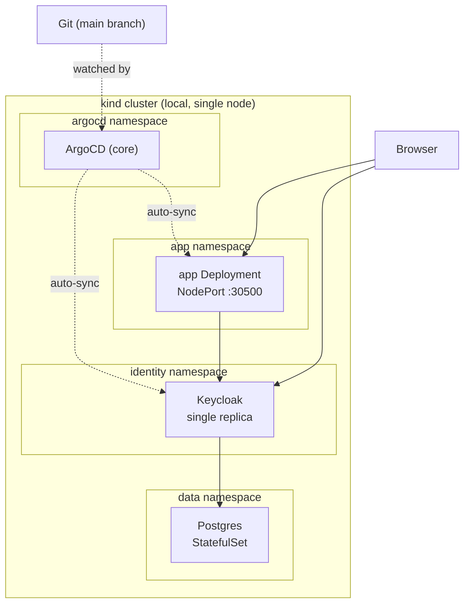
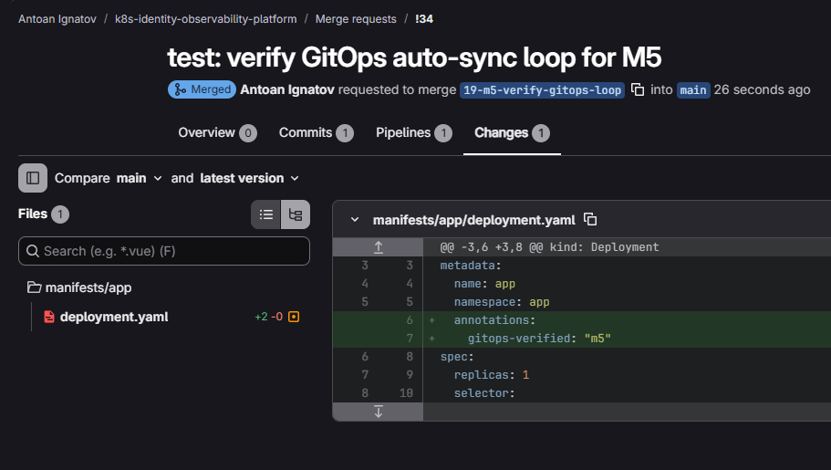
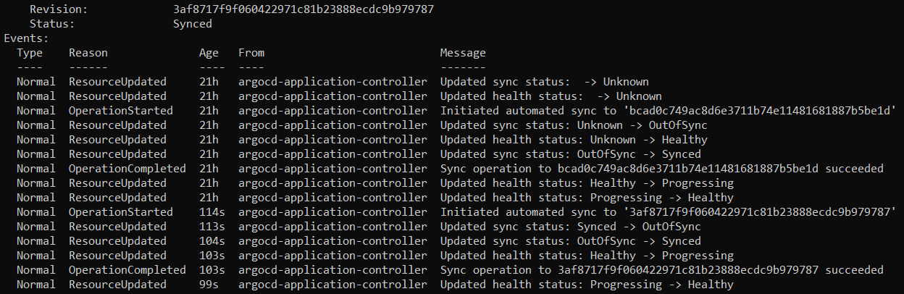
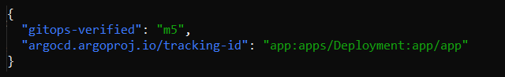
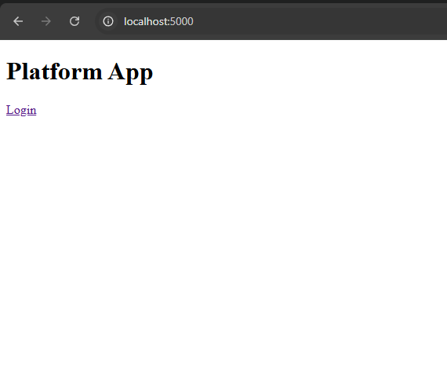
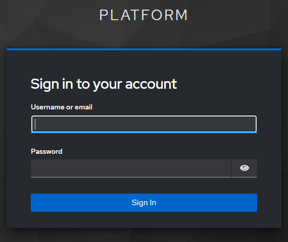
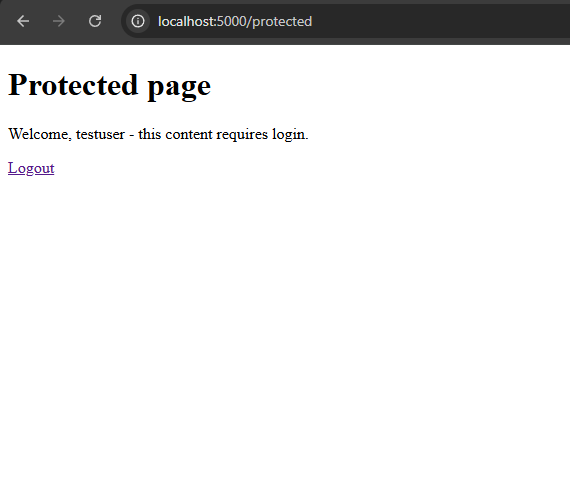
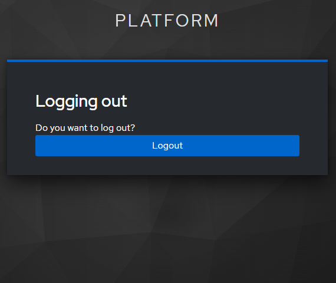
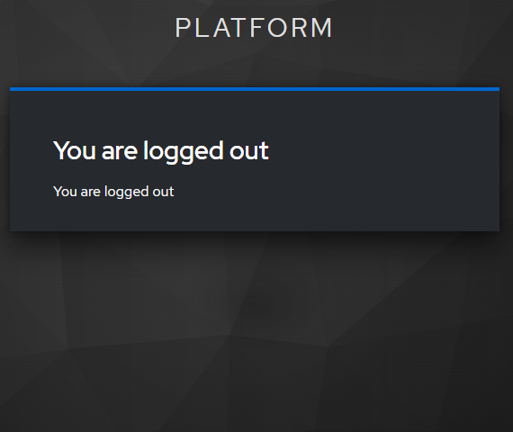
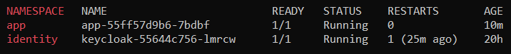

# GitOps Identity and Observability Platform

## Project Status

**Current Version:** 0.5.0

**Status:** Milestones 1 through 4 complete - self-hosted GitLab Runner registered,
CI pipeline (lint, build, scan, push) running green on every push to main, with
Trivy vulnerability DB caching to avoid slow/unreliable re-downloads. kind cluster
provisioned with namespaces, PostgreSQL deployed and operated, Python backup
script verified. Keycloak deployed in production mode via a custom CI-built
image, wired to PostgreSQL, with a realm and client configured for SSO. A minimal
Flask application is deployed behind Keycloak, with a verified end-to-end SSO
login flow through a NodePort Service. ArgoCD (core install) manages the app 
and Keycloak deployments via GitOps - manifest changes in git sync to the cluster 
automatically, verified end to end. Observability layer in progress.

## Introduction

Kubernetes-based platform demonstrating GitOps deployment, centralized logging, identity management, and CI/CD. Built to fill stack gaps from two target job listings (Junior DevOps Engineer; DevOps/Platform) not covered by other portfolio projects. The application is a minimal placeholder - the platform itself is the point.

## Table of Contents

1. [Skills Demonstrated](#skills-demonstrated)
2. [Architecture](#architecture)
3. [Repository Structure](#repository-structure)
4. [Technology Stack](#technology-stack)
5. [CI/CD Pipeline](#cicd-pipeline)
6. [Identity and Access](#identity-and-access)
7. [Observability](#observability)
8. [Portability](#portability)
9. [Engineering Challenges and Design Decisions](#engineering-challenges-and-design-decisions)
10. [Planned Improvements](#planned-improvements)
11. [AI Diligence Statement](#ai-diligence-statement)

## Skills Demonstrated

- GitLab CI/CD pipeline design, running on a self-hosted runner (no shared runner dependency)
- GitOps deployment workflow with ArgoCD
- Identity and access management with Keycloak, backed by an operated PostgreSQL instance
- OpenID Connect application integration (Authlib) with an identity provider, including cross-namespace service resolution
- Centralized logging with the ELK stack
- Kubernetes cluster operation on a resource-constrained local machine
- Python automation for operational tasks (backup, health checks)
- SDLC practice via GitLab Issues, Milestones, and a branch/MR/squash-merge workflow

## Architecture



## Repository Structure

```
app/                Flask application with Keycloak OIDC login
manifests/
  identity/         Keycloak Deployment, Service, realm export backup
  app/              Flask app Deployment and NodePort Service
  data/             PostgreSQL StatefulSet and Service
  argocd/           ArgoCD install manifest, default AppProject, and
                    application definitions for app and identity
cluster/
  kind-config.yaml  Local cluster configuration
  namespaces.yaml   Namespace definitions (app, identity, data, logging)
docker/             Custom Dockerfiles (Keycloak two-stage build)
scripts/            Automation scripts (backup, health-check, environment bootstrap)
docs/               Documentation, screenshots, and one-off verification manifests
                    (e.g. es-smoke-test.yaml from the Milestone 2 smoke test)
backups/            Local-only backups (gitignored) - Postgres dumps, Keycloak realm exports
.gitlab-ci.yml      CI/CD pipeline definition
```

## Technology Stack

- **Cluster:** kind (local)
- **CI/CD:** GitLab CI/CD, self-hosted GitLab Runner
- **GitOps:** ArgoCD
- **Identity:** Keycloak
- **Database:** PostgreSQL
- **Logging:** ELK (Elasticsearch, Fluent Bit / Logstash, Kibana)
- **Automation:** Python
- **Repository:** GitLab (primary), mirrored to GitHub

## CI/CD Pipeline

Pipeline runs on a self-hosted GitLab Runner (Docker executor), avoiding any
dependency on GitLab's shared runners. Stages: lint (ruff) ->
build (Docker) -> scan (Trivy) -> push (GitLab Container Registry). Push only
runs on `main`, gated behind a required passing pipeline.

A separate build/scan/push pipeline builds a custom Keycloak image via a
two-stage Dockerfile, since Keycloak's stock image doesn't support
`start --optimized` without a prior build step. Trivy's vulnerability and 
Java dependency databases are cached via a runner-level host-bound volume 
(not GitLab's archive-based cache, which proved too slow for a 900MB+ database 
on this hardware) to avoid slow re-downloads and known reliability issues with Trivy's Java DB.

Trivy scan findings are currently reported but non-blocking (no `--exit-code`
set) - visibility without gating the pipeline on every transitive CVE in
upstream base images.

Deployment has moved from manual `kubectl apply` to GitOps: ArgoCD (core
install, no UI/CLI) watches `manifests/app` and `manifests/identity`
directly and auto-syncs on every merge to main, with self-healing enabled
so manual cluster drift is automatically reverted. CI and CD are
deliberately decoupled - GitLab CI still only builds and pushes images,
path-filtered to skip when `app/` or `docker/keycloak/` haven't changed;
ArgoCD is what actually applies manifest changes to the cluster.





**LATER:** screenshot of a green pipeline run.

## Identity and Access
Keycloak runs in production/optimized mode as a single replica, wired to the
existing PostgreSQL instance via a dedicated `keycloak` database and role.
The image is built via a two-stage Dockerfile (pre-baking `kc.sh build` output)
and published through a dedicated CI job to GitLab's Container Registry, since
the stock Keycloak image doesn't support `start --optimized` out of the box.

A `platform` realm and `placeholder-app` client (confidential, standard flow)
are configured for the application's SSO login, to be wired up in Milestone 4.

HA is not run in this environment due to local resource constraints. Keycloak
supports HA via an external distributed cache (Infinispan or Redis) for shared
session state across replicas, avoiding sticky-session dependence on a single
pod. This would require an external Infinispan/Redis cluster, `KC_CACHE=ispn`
with remote-store configuration, and multiple replicas behind a load balancer
with no session affinity requirement.

A minimal Flask application (`app/`) authenticates against the `placeholder-app`
client using Authlib, running as a Deployment with a NodePort Service
(`manifests/app/`) in the `app` namespace. The app resolves Keycloak via
in-cluster DNS (`keycloak.identity.svc.cluster.local`) rather than the
browser-facing hostname - see Engineering Challenges for why that needed its
own fix.








## Observability

**LATER:** ELK stack setup, log flow from cluster to Kibana, Fluent Bit and Logstash configurations (staged separately).

**LATER:** screenshot of Kibana dashboard.

## Portability

The environment is reproducible on a second machine via two bootstrap scripts (`scripts/bootstrap-windows.ps1`, `scripts/bootstrap-wsl.sh`), covering WSL2, native Docker, kind/kubectl/helm, and GitLab Runner setup end to end. See `docs/travel-laptop-setup.md` for the full walkthrough.

## Engineering Challenges and Design Decisions

**No credit card, no shared runners:** GitLab requires card verification to use shared runners on GitLab.com. Solved by running a self-hosted GitLab Runner locally instead, registered against the project with shared/instance runners explicitly disabled.

**RAM-constrained local environment:** Developing on an 8GB machine ruled out running the full stack concurrently. Components are staged up and down deliberately, with WSL2's memory cap raised to 6GB and swap enabled as a buffer. Verified with a smoke test: a kind cluster plus a single-node Elasticsearch instance (512Mi heap) left roughly 3.9Gi available after settling, confirming the staging strategy has headroom before heavier components are added.

**Runner token exposure:** A runner authentication token was inadvertently shared during setup. Rotated immediately via `gitlab-runner reset-token` before continuing.

**Secrets over plaintext:** PostgreSQL credentials are generated with a random password and created directly as a Kubernetes Secret (`kubectl create secret`), never written to a committed manifest. A Secret alone is only base64-encoded, not encrypted, so this is treated as a floor, not a solution. Vault or External Secrets Operator, listed under Planned Improvements, is the intended path to real encryption at rest.

**Keycloak `start --optimized` requires a pre-built image:** The stock Keycloak
image fails outright if `--optimized` is passed without a prior `kc.sh build`
step baked in. Solved with a two-stage Dockerfile that runs the build at image-build
time, published via a dedicated CI job to the project's Container Registry.

**Keycloak hostname/redirect URL configuration:** Behind a plain port-forward
(no reverse proxy), Keycloak's generated redirect URLs dropped the port,
causing browser requests to hang or fail. Resolved by setting `KC_HOSTNAME` to
a full URL (scheme + host + port) rather than a bare hostname, per Keycloak's
hostname v2 configuration guide.

**Trivy Java DB reliability:** Scanning a JVM-based image (Keycloak) requires
Trivy's ~900MB Java DB, stored under the same cache directory as the ~100MB
main vulnerability DB. GitLab's built-in cache mechanism works by archiving
that directory into a zip and restoring it each run - on this project's older,
slower hardware, archiving a cache that size took 20+ minutes on its own,
eventually exceeding both GitLab Runner's internal cache-archiver timeout and
the project's 1-hour job timeout, failing the pipeline outright. Increasing
the job timeout alone did not solve this, since the bottleneck was CPU-bound
compression, not simply a slow-but-completable step.

Resolved by bypassing GitLab's archive-based cache entirely: the runner's
`config.toml` bind-mounts a persistent host directory
(`/home/gitlab-runner/trivycache` on the runner machine) directly into every
scan job container, so the DB is present on disk with no per-run archive or
extract step. Both databases were pre-populated once, out-of-band, via
`trivy image --download-db-only` and `trivy image --download-java-db-only`,
avoiding a cold multi-hundred-MB download inside a time-boxed CI job.

**Cross-namespace Keycloak hostname resolution:** `KC_HOSTNAME` is a single
fixed value Keycloak uses for every URL it advertises - fine for a browser,
but wrong for the app pod's server-to-server token exchange, which needs
Keycloak's in-cluster DNS name instead. Resolved by enabling Keycloak's
`hostname:v2` backchannel-dynamic option
(`KC_HOSTNAME_BACKCHANNEL_DYNAMIC=true`), which resolves backend endpoint
URLs based on the address the request actually came in on, while keeping the
browser-facing hostname fixed.

**NodePort not reachable from the host on kind + WSL2:** A Service's NodePort
opens on every node's network interface by default, but kind's node runs as a
Docker container inside WSL2's own network namespace - not on WSL2's main
interface, which is the only one Windows automatically forwards to
`localhost`. Reaching the container's own Docker-bridge IP directly from
Windows is a documented, unresolved limitation (Windows can route out to it
but the return path fails). Verified by keeping the Service as a genuine
NodePort in the manifest, but testing via `kubectl port-forward` instead of
the raw NodePort address - a testing-method workaround, not a manifest change.

**Secrets committed in plaintext (M3 mistake, caught in M5):** During an earlier
session a file `keycloak-secret.yaml` with real admin and database
credentials in plaintext was created and committed to git. The admin password 
belongs to the initial bootstrap account, which was deleted after a replacement 
admin user was created - no live exposure there. 
The Postgres role password was live and
was rotated directly in Postgres (`ALTER ROLE`), not just in the Secret
object, since Keycloak's `KC_BOOTSTRAP_ADMIN_*` env vars and DB credentials
only take effect at first startup and don't retroactively change an
already-running system. Both Secrets are now created imperatively via
`kubectl create secret`, matching the pattern already used for
`app-secrets` and `gitlab-registry` - matching real values are never
committed to the repository.

**ArgoCD core install has no default AppProject:** A full ArgoCD install
auto-creates a `default` AppProject via `argocd-server` at first startup.
Core install skips this entirely, so both Applications failed with
`InvalidSpecError: Application referencing project default which does not
exist` until the AppProject was created as its own committed manifest.

**ArgoCD directory sources parse every .yaml/.json file as a manifest:**
`manifests/identity/` contains a Keycloak realm export (JSON, not a
Kubernetes resource) alongside the real Deployment/Service. Without
restricting the Application's source to `directory.include: '*.yaml'`,
ArgoCD would attempt to parse the export file as a manifest and fail.

**LATER:** engineering challenges from ELK staging (M6),

## Planned Improvements

- KrakenD API Gateway in front of the Keycloak-protected app
- Docker Swarm administration (separate demo)
- MLOps / GPU workloads in Kubernetes (separate project)
- Keycloak HA: external session store (Infinispan/Redis)
- Production secrets management: Vault or External Secrets Operator

## AI Diligence Statement

An AI assistant was used throughout this project to augment learning and expedite execution: explaining concepts, drafting manifests and scripts for review, and troubleshooting. All architectural decisions, command execution, and verification of results were performed by the author.
